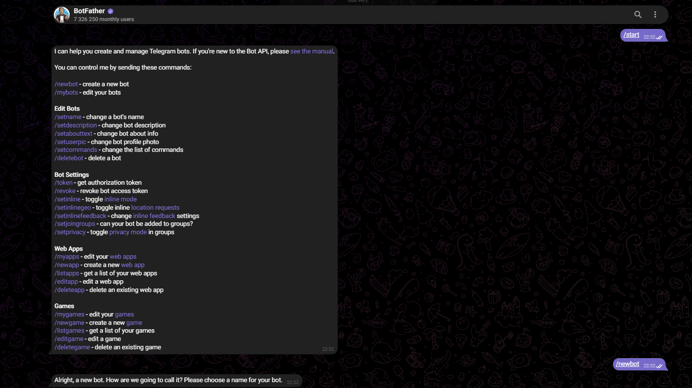
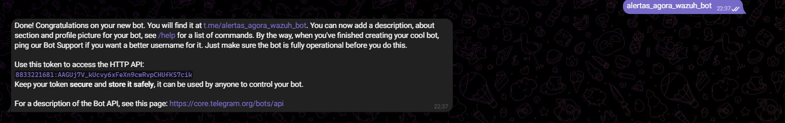
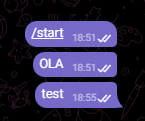
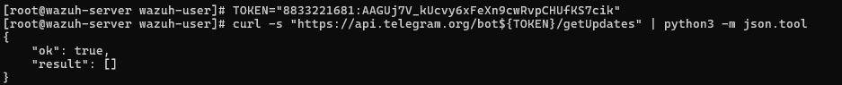
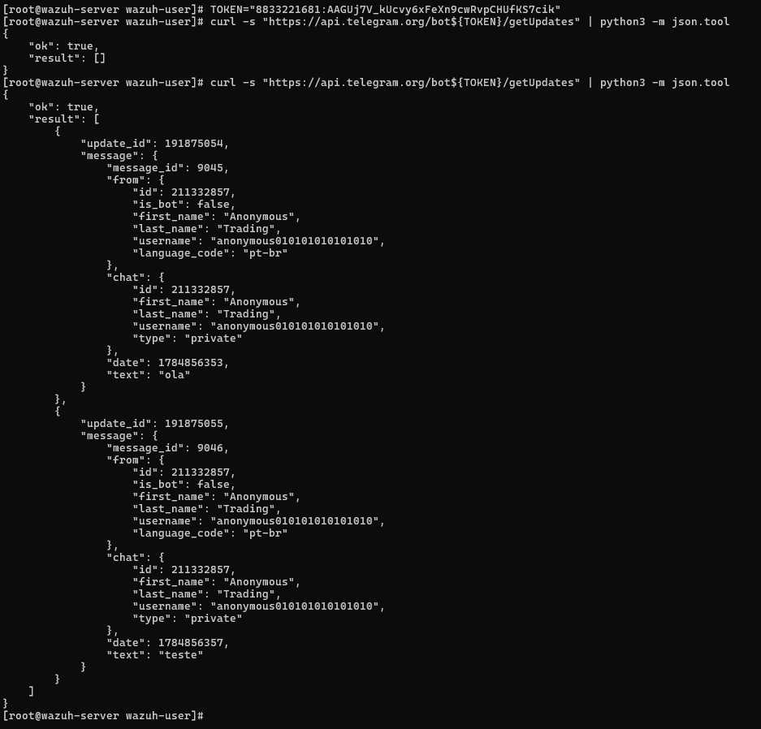
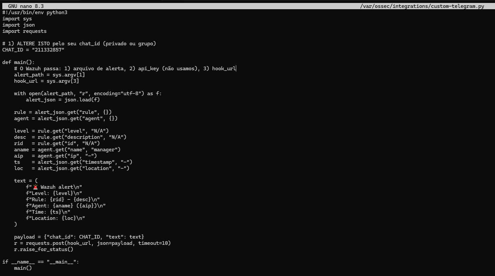
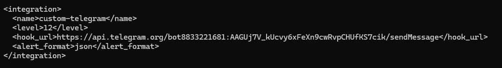
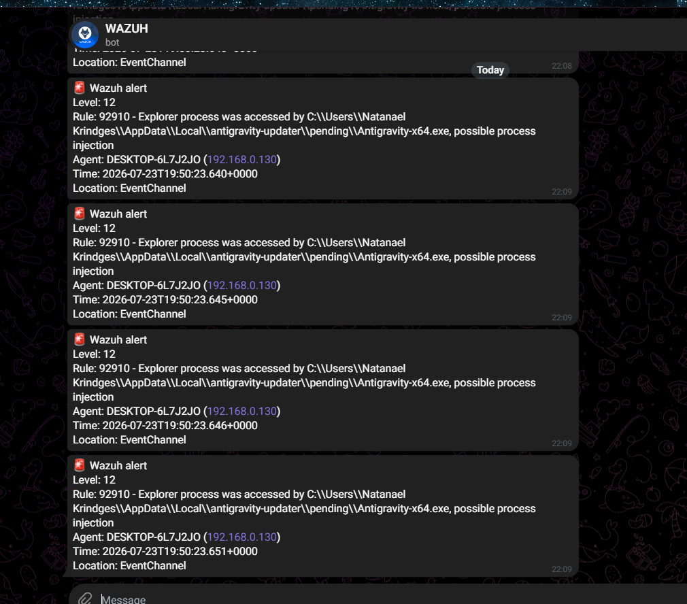

# 📄 Guia de Integração: Wazuh Manager + Alertas via Telegram

Documentação completa e passo a passo para configurar o **Wazuh Manager** para enviar notificações de alertas em tempo real para o **Telegram** através de um Bot customizado.

---

## 📋 Pré-requisitos

* **Wazuh Manager:** Instalado e em execução (acesso `root` / `sudo`).
* **Git:** Instalado no servidor do Wazuh Manager (`sudo apt install git` ou `sudo dnf install git`).
* **Telegram:** Uma conta ativa no aplicativo Telegram.
* **Conectividade:** Permissão de rede para o servidor Wazuh Manager realizar requisições HTTPS de saída para `https://api.telegram.org`.

---

## 1. Criar o Bot e Obter o TOKEN (via BotFather)

1. No aplicativo Telegram, pesquise por `@BotFather` (certifique-se de escolher o perfil oficial verificado com o selo azul).

2. Inicie a conversa enviando os comandos:
   ```text
   /start
   /newbot
   ```
   
   
4. O **BotFather** solicitará duas informações:
   * **Nome de exibição:** Exemplo: `Wazuh Alerts`
   * **Username do bot:** Deve terminar obrigatoriamente com `bot`. Exemplo: `alertas_agora_wazuh_bot`
5. O BotFather enviará uma mensagem de confirmação contendo o **TOKEN de Acesso à API HTTP**:
   * *Formato:* `8833221681:AAGUj7V_kUcvy6xFeXn9cwRvpCHUfKS7cik`

    

📌 **Guarde este TOKEN de forma segura**, pois ele será utilizado para autenticar as chamadas da API.

---

## 2. Obter o CHAT_ID

1. Abra uma conversa direta com o bot que você acabou de criar (link: `t.me/SEU_BOT_USERNAME`).
2. Clique no botão **Start** (Iniciar) e envie mensagens de teste (exemplo: `ola` ou `teste`).



3. No terminal do servidor Wazuh Manager, defina a variável temporária com o seu **TOKEN** e consulte os updates da API do Telegram:

   ```bash
   TOKEN="coloca_seu_token"
   curl -s "https://api.telegram.org/bot${TOKEN}/getUpdates" | python3 -m json.tool
   ```



4. Na resposta em JSON retornada pelo comando, localize o objeto `"chat"`:

   ```json
   "chat": {
       "id": 211332857,
       "first_name": "Anonymous",
       "username": "anonymous0101010101010",
       "type": "private"
   }
   ```

✅ O valor numérico do campo `"id"` (exemplo: `211332857`) é o seu **CHAT_ID**. Anote este número.



⚠️ **Nota:** Se a lista `result` retornar vazia `[]`, certifique-se de ter clicado em **Start** e enviado uma nova mensagem no chat privado com o bot antes de rodar o comando `curl` novamente.

---

## 3. Baixar os Scripts de Integração no Wazuh Manager

Acesse o servidor do Wazuh Manager e clone este repositório (ou copie os arquivos diretamente):

```bash
cd /tmp
sudo git clone https://github.com/nks1097/INTEGRACAO_WAZUH_TELEGRAM.git
cd INTEGRACAO_WAZUH_TELEGRAM
```

---

## 4. Copiar os Scripts para o Diretório do Wazuh

O repositório disponibiliza os arquivos `custom-telegram` (wrapper bash) e `custom-telegram.py` (script Python). Copie-os para o diretório de integrações do Wazuh:

```bash
sudo cp -f custom-telegram custom-telegram.py /var/ossec/integrations/
```

---

## 5. Configurar Permissões de Execução (MUITO IMPORTANTE)

Defina o proprietário `root:wazuh` e as permissões de execução (750) para que o daemon do Wazuh consiga rodar os scripts:

```bash
sudo chown root:wazuh /var/ossec/integrations/custom-telegram /var/ossec/integrations/custom-telegram.py
sudo chmod 750 /var/ossec/integrations/custom-telegram /var/ossec/integrations/custom-telegram.py
```

---

## 6. Editar o CHAT_ID no Script Python

Edite o script de integração Python para inserir o seu `CHAT_ID`:

```bash
sudo nano /var/ossec/integrations/custom-telegram.py
```

Localize a variável `CHAT_ID` no topo do arquivo e atribua o número obtido no **Passo 2**:

```python
# 1) ALTERE ISTO pelo seu chat_id (privado ou grupo)
CHAT_ID = "211332857"
```



Salve e feche o arquivo (`Ctrl + O`, `Enter`, `Ctrl + X`).

---

## 7. Configurar a Integração no ossec.conf

Abra o arquivo de configuração principal do Wazuh Manager:

```bash
sudo nano /var/ossec/etc/ossec.conf
```

Dentro da tag `<ossec_config>`, insira o bloco da nova integração:

```xml
<integration>
  <name>custom-telegram</name>
  <level>8</level>
  <hook_url>https://api.telegram.org/botPEGA_AQUI_SEU_TOKEN/sendMessage</hook_url>
  <alert_format>json</alert_format>
</integration>
```

📌 **Atenção:**
* Substitua `PEGA_AQUI_SEU_TOKEN` pelo seu Token real mantendo a palavra `bot` imediatamente antes dele (ex: `bot8833221681:AA.../sendMessage`).
* A tag `<level>8</level>` define que apenas alertas com nível 8 ou superior dispararão a notificação no Telegram (para testes iniciais, você pode alterar temporariamente para `<level>3</level>`).

  

Salve o arquivo (`Ctrl + O`, `Enter`, `Ctrl + X`).

---

## 8. Reiniciar o Wazuh Manager

Aplique as novas configurações reiniciando o serviço do manager:

```bash
sudo systemctl restart wazuh-manager
```

---

## 9. Teste Rápido de Envio de Alerta (Simulação Manual)

Para validar a comunicação com a API do Telegram sem precisar aguardar um evento real do sistema, crie um evento de teste simulado:

1. Crie o arquivo JSON de evento temporário:
   ```bash
   cat >/tmp/alert-test.json <<'EOF'
   {
     "timestamp":"2026-07-23T10:00:00Z",
     "location":"manual-test",
     "rule":{"id":"99999","level":10,"description":"Manual test custom-telegram"},
     "agent":{"name":"siem","ip":"127.0.0.1"}
   }
   EOF
   ```

2. Execute o script representando o usuário `wazuh` (substitua o Token na URL):
   ```bash
   sudo -u wazuh /var/ossec/integrations/custom-telegram \
     /tmp/alert-test.json \
     "dummy" \
     "https://api.telegram.org/bot8833221681:AAGUj7V_kUcvy6xFeXn9cwRvpCHUfKS7cik/sendMessage"
   ```

✅ Se a mensagem de teste chegar no seu Telegram, a integração via script está funcionando perfeitamente!

---

## 10. Teste com um Alerta Real do Sistema

Para validar a geração automática do alerta através do motor do Wazuh Manager:

1. Execute um comando que gere um evento auditado de nível igual ou superior a 8 (por exemplo, a criação de um usuário no Linux):
   ```bash
   sudo useradd testuser123a
   ```
2. Aguarde alguns segundos e verifique o Telegram. Você deverá receber uma mensagem com a estrutura formatada do alerta:

```text
🚨 Wazuh alert
Level: 8
Rule: 5902 - New user added to the system.
Agent: siem (127.0.0.1)
Time: 2026-07-23T22:09:00Z
Location: /var/log/secure
```
 
